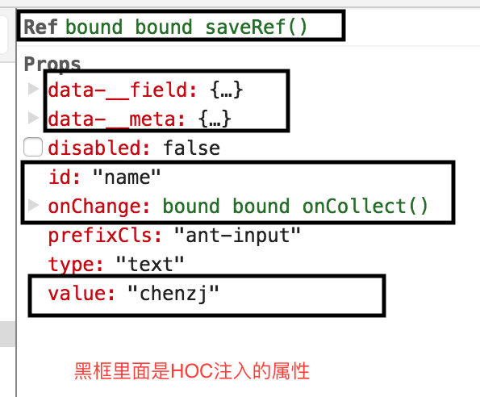
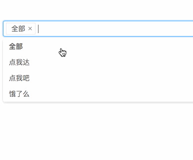

# 解读Ant Design Form中的onChange

主要讲[Ant Design Form](https://ant.design/components/form-cn/)组件使用中碰到的问题（onChange），顺便源码解析。

接下来说的Form代表ant-form([react-component/form](https://github.com/react-component/form))

## 一、Form的主要作用
首先了解什么是Form
> React High Order Form Component(web & react-native) 

1、是一个Form高阶组件，[HOC](https://reactjs.org/docs/higher-order-components.html)官方文档已经说了很详细了，简单说下，`HOC`是设计模式中`装饰模式`的一个实践，在不改变原有的用途上进行组件增强。

2、让被包装的组件具备表单功能，其中的表单组件具备数据双向绑定，以及一些校验等一系列功能。


## 二、创建Form的大致原理（如何绑定）
下面是最基本Form代码片段，里面有一个id/key为`name`的输入框。
```javascript
class Demo1 extends Component {
  render() {
    const { getFieldProps } = this.props.form;
    return (
      <div>
        <Input {...getFieldProps('name')} />
      </div>
    );
  }
}
export default Form.create()(Demo1);
```
通过`Form.create`初始化这个组件；`HOC`对被包装的`props`进行了拦截，注入了自己的对象`form`；`getFieldProps`基本等价于`getFieldDecorator`只是写法不同，这个方法主要返回`onChange(onXXX) value`这两个重要的双向绑定的属性，最终返回值作用于`Input`上面

再通过`form.validateFields/validateFieldsAndScroll`就能完成简单的数据提交了。

下面是通过react-dev-tools在Chrome中查看Input的属性结果



其它属性是`ant Input`的属性。

通过上幅图我们大致了解了`getFieldProps`主要返回了哪些值。

## 三、Form中的onChange（如何存储，如何更新）

***我看到上图中的的`onChange`方法，是一个名叫`onCollect`被`bind`后的方法，我们搜索源码中的`onCollect`***

```javascript
// 代码片段一
onCollect(name_, action, ...args) {
  const { name, field, fieldMeta } = this.onCollectCommon(name_, action, args);
  const { validate } = fieldMeta;
  const newField = {
    ...field,
    dirty: hasRules(validate),
  };
  // setFields请查看代码片段二
  this.setFields({
    [name]: newField,
  });
},
```
通过`onCollectCommon`方法 最终返回新的`newField`然后调用`setFields`方法

```javascript
// 代码片段二
setFields(maybeNestedFields) {
  const fields = this.fieldsStore.flattenRegisteredFields(maybeNestedFields);
  this.fieldsStore.setFields(fields);
  if (onFieldsChange) {
    const changedFields = Object.keys(fields)
      .reduce((acc, name) => set(acc, name, this.fieldsStore.getField(name)), {});
    onFieldsChange(this.props, changedFields, this.fieldsStore.getNestedAllFields());
  }
  this.forceUpdate();
},
```
1、看`代码片段二`可得最终表单里的数据是放到一个叫`fieldsStore`里。

2、通过`fieldsStore`把新的`Fields`设置到这个对象里，再通过`this.forceUpdate()`手动去做`render`。*这句可以忽视（解析`Element`->`Dom Element`->`virtual Dom` diff `old virtual Dom` 生成新的页面）。*


## 四、被包装组件中的onChange
> 有一个需求，一个渠道的多选控件，有选项【点我达】【点我吧】【饿了么】还有一个【全部】，全部跟其它选择具有互斥效果。比如选了【点我达】，【全部】这个选择要删除掉；比如选了【全部】，其他的选项要清空掉。

如下图所示



下面是最开始实现的代码

```javascript
// 代码片段三
const data = [
  { name: '全部', value: 0 },
  { name: '点我达', value: 1 },
  { name: '点我吧', value: 2 },
  { name: '饿了么', value: 3 },
]
class Demo2 extends Component {
  render() {
    const { getFieldProps, setFieldsValue, getFieldValue } = this.props.form;
    return (
      <div>
        <Select
          {...getFieldProps('name', {
          })}
          style={{ width: 800 }}
          mode="multiple"
          onChange={(nextValues) => {
            let targetValues = []
            const nowValues = getFieldValue('name') || [];
            if (nowValues.length > nextValues.length) {
              targetValues = nextValues;
            } else {
              const selectValue = nextValues.find(nv => nowValues.indexOf(nv) === -1)
              if (selectValue === '0') {
                targetValues = ['0']
              } else {
                targetValues = nextValues.filter(x => x !== '0');
              }
            }
            setFieldsValue({ name: targetValues })
          }}
        >
          {data.map((item) => <Option key={item.value}>{item.name}</Option>)}
        </Select>
      </div>
    );
  }
}
```
监听`onChange`的变化，然后根据变化的数据转化成业务需要的数据，通过`setFieldsValue`设置的新的数据。但是很遗憾更新值是失败的。

在上面的基础上，改下代码
```javascript
  // 代码片段四
  // some code...
  setTimeout(() => {
    setFieldsValue({ name: targetValues })
  }, 0);
  // some code...
```
把`setFieldsValue`放到下个事件循环中去执行，才能成功。这写法虽然实现了功能，但是有两缺点：

1、`setTimeout 0`代码不雅观。

2、本来一次渲染就解决的问题，现在要两次渲染。

## 五、为什么在onChange中去setFieldsValue是没有效果的呢？

我们带着这个疑问来看源码，开始讲的`onCollect`是收集表单组件的变化，所以手动写的`onChange`方法，是不会直接作用于原始的方法上；`onChange`方法实际会在`onCollect`中去执行；接下来看下源码具体怎么执行的，

`代码片段一`可以看出`onCollect`方法中调用了`onCollectCommon`，根据意思是通用的收集变化的处理方法，看该方法源码
```javascript
// action实际上是trigger 默认是onChange
onCollectCommon(name, action, args) {
  const fieldMeta = this.fieldsStore.getFieldMeta(name);
  if (fieldMeta[action]) {
    // onchange getFieldProps中写法
    fieldMeta[action](...args);
  } else if (fieldMeta.originalProps && fieldMeta.originalProps[action]) {
    // onchange getFieldDecorator中的写法
    fieldMeta.originalProps[action](...args);
  }
  // some code...
  // onchange同步执行完后再执下面代码，下面的返回并不会受onchange同步执行的影响
  return ({ name, field: { ...field, value, touched: true }, fieldMeta });
},
```
`onChange`之类的方法是在`fieldMeta[action](...args);`或者`fieldMeta.originalProps[action](...args);`这两行代码执行的，在这进行`setFieldsValue`（代码片段三中执行的方法）会进行一次刷新，但是后续执行`setFields`会覆盖掉之前的数据，`setFields`并不会受中间的`setFieldsValue`影响，还是设置原来本需要设置的值。所以就很好解释了`为什么在onChange中去setFieldsValue是没有效果的呢？`。

## 六、Form没有提供这样的API吗

仔细查阅文档后发现有一个属性，`options.normalize`

> 官方解释：转换默认的 value 给控件；function(value, prevValue, allValues): any

```javascript
class Demo4 extends Component {
  render() {
    const { getFieldProps } = this.props.form;
    return (
      <div>
        <Select
          {...getFieldProps('name', {
            normalize: (value, prevValue, allValues) => {
              let targetValues = []
              const nowValues = prevValue || [];
              if (nowValues.length > value.length) {
                targetValues = value;
              } else {
                const selectValue = value.find(nv => nowValues.indexOf(nv) === -1)
                if (selectValue === '0') {
                  targetValues = ['0']
                } else {
                  targetValues = value.filter(x => x !== '0');
                }
              }
              return targetValues;
            }
          })}
          style={{ width: 800 }}
          mode="multiple"
        >
          {data.map((item) => <Option key={item.value}>{item.name}</Option>)}
        </Select>
      </div>
    );
  }
}
```

以上是`normalize`的代码，通过转换返回新的值，不会出现两次渲染。接下来看下源码是如何实现的。

在代码片段2中`this.fieldsStore.setFields(fields)`，查看`createFieldsStore`文件中的`setFields`方法

```javascript
setFields(fields) {
  const fieldsMeta = this.fieldsMeta;
  const nowFields = {
    ...this.fields,
    ...fields,
  };
  const nowValues = {};
  Object.keys(fieldsMeta)
    .forEach((f) => nowValues[f] = this.getValueFromFields(f, nowFields));
  Object.keys(nowValues).forEach((f) => {
    const value = nowValues[f];
    const fieldMeta = this.getFieldMeta(f);
    // 这里写的很明白 存在normalize 调用这个方法 返回新的nowFields
    if (fieldMeta && fieldMeta.normalize) {
      const nowValue =
              fieldMeta.normalize(value, this.getValueFromFields(f, this.fields), nowValues);
      if (nowValue !== value) {
        nowFields[f] = {
          ...nowFields[f],
          value: nowValue,
        };
      }
    }
  });
  this.fields = nowFields;
}
```
`normalize`这个是官方提供的在改变数据，重新渲染之前，提供的一个转换`fields`的方法。

### 七、normalize存在的问题？

如果表单组件使用了`rules`检验，每次值改变`normalize`会调用两次，看源码如果是具有检验的会去绑定`onCollectValidate`,后续调用`validateFieldsInternal`

```javascript
validateFieldsInternal(fields, {
  fieldNames,
  action,
  options = {},
}, callback) {
  //some code...
  // 这里会执行一次
  this.setFields(allFields);
  // some code...
  
    // 这里会执行第二次
    this.setFields(nowAllFields);
    // some code...
},
```
1、上面精简了代码，提取两个关键的点，两次的`setFields`，第一次是正常的数据更新(dirty: true)，第二次是检验后会产生了一些新的数据（是否检验成功等信息）再次去更新渲染(dirty: false)。

2、因为`setFields`中会执行`normalize`，这也是会执行两次的原因。

3、个人理解第一次执行去做`normalize`就可以，第二次就没必要去回调了。（有不同看法可以探讨）

## 八、总结

1、不要在onChange中去设置Form中的值，要在`normalize`这个属性中去做。

2、使用中碰到比较费解问题，所以需要看源码来理解。